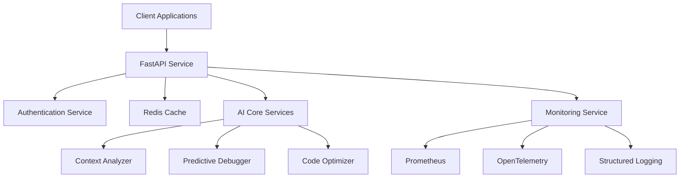
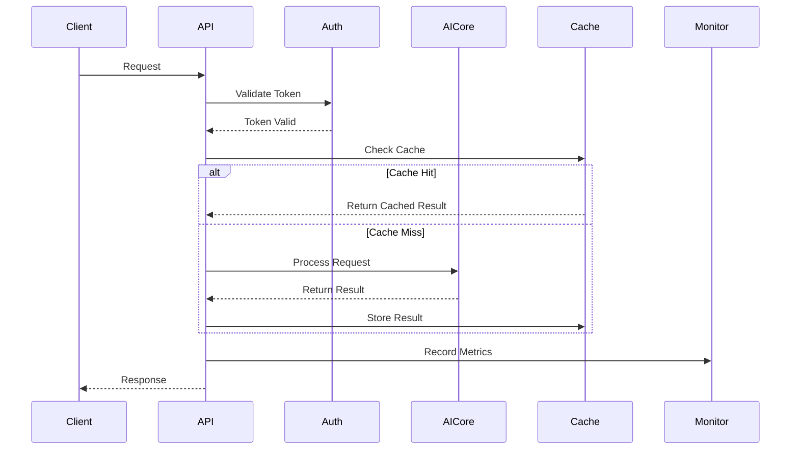
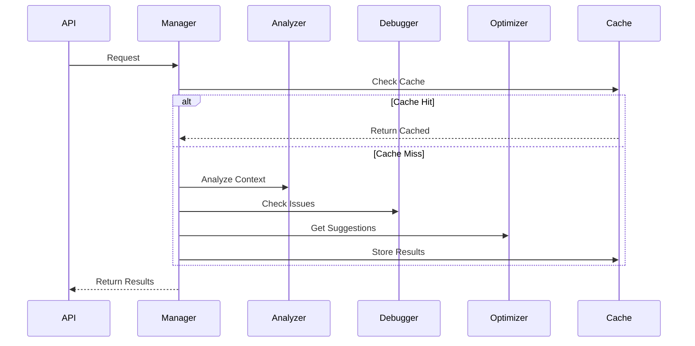

# OmniStack Architecture

## System Overview

OmniStack is built on a modular, microservices-based architecture that prioritizes scalability, maintainability, and extensibility.

## Core Components

### 1. API Layer (`/api`)
- **FastAPI Service**: Main entry point for all client interactions
- **Rate Limiting**: Token bucket algorithm with Redis
- **Authentication**: JWT-based with role-based access
- **Middleware**: Metrics, logging, and error handling
- **OpenAPI/Swagger**: Automatic API documentation

### 2. AI Core (`/ai_core`)
- **Context Analyzer**: Understands code context and relationships
  - Uses transformer models for semantic analysis
  - Maintains code quality scoring
  - Provides contextual suggestions
  
- **Predictive Debugger**: Proactive bug detection
  - ML-based issue detection
  - Pattern recognition from training data
  - Severity classification
  
- **Code Optimizer**: Performance enhancement
  - Static analysis for bottlenecks
  - Resource usage optimization
  - Best practices enforcement
  
- **Service Manager**: AI service orchestration
  - Request routing and load balancing
  - Model lifecycle management
  - Cache coordination

### 3. Infrastructure (`/infrastructure`)

#### Authentication (`/auth`)
- JWT token management
- Role-based access control
- Session handling
- Security middleware

#### Caching (`/cache`)
- Redis-based caching
- Model prediction caching
- Rate limit tracking
- Session storage

#### Monitoring (`/monitoring`)
- Prometheus metrics collection
- OpenTelemetry tracing
- Resource usage tracking
- Performance monitoring

#### Configuration (`/config`)
- Environment-specific settings
- Feature flags
- Service configuration
- Security settings

## Data Flow

### 1. Request Flow

### 2. AI Service Flow

## Security

### 1. Authentication Flow
- Client requests with JWT token
- Token validation and role checking
- Rate limiting per client
- Session management

### 2. Data Protection
- Environment variable secrets
- Encrypted storage
- Secure communication
- Access logging

## Scalability

### 1. Horizontal Scaling
- Kubernetes deployment
- Service replication
- Load balancing
- Auto-scaling

### 2. Performance Optimization
- Redis caching
- Async operations
- Resource pooling
- Request batching

## Monitoring and Observability

### 1. Metrics
- Request rates and latencies
- Resource utilization
- Cache hit rates
- Error rates

### 2. Logging
- Structured JSON logs
- Context-aware logging
- Error tracking
- Audit trails

### 3. Tracing
- Request tracing
- Performance profiling
- Dependency mapping
- Bottleneck identification

## Development Workflow

### 1. Local Development
- Docker Compose for services
- Hot reload for development
- Local environment setup
- Testing framework

### 2. CI/CD Pipeline
- Automated testing
- Code quality checks
- Security scanning
- Deployment automation

## Future Enhancements

### 1. Planned Features
- Enhanced ML models
- Additional language support
- Plugin system
- Advanced analytics

### 2. Scalability Improvements
- Distributed training
- Enhanced caching
- Performance optimizations
- Resource management

## References

- [FastAPI Documentation](https://fastapi.tiangolo.com/)
- [Redis Documentation](https://redis.io/documentation)
- [Prometheus Documentation](https://prometheus.io/docs/)
- [OpenTelemetry Documentation](https://opentelemetry.io/docs/)
